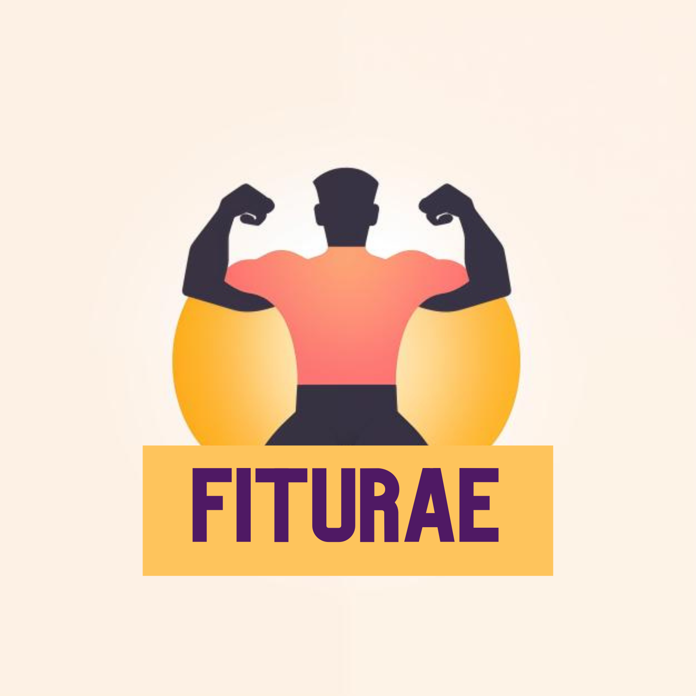

   

# Fiturae: Your Digital Fitness Companion

Fiturae: Your Digital Fitness Companion
Welcome to Fiturae, the innovative web app that takes your fitness tracking to the next level. Developed with passion and technical expertise, Fiturae is more than just an app – it's a comprehensive tool that accompanies and supports you on your fitness journey. Whether you're just starting out or an experienced athlete, Fiturae offers the flexibility and features you need to effectively track, plan, and optimize your workouts. Dive into a world where fitness meets technology, and discover how Fiturae can revolutionize your training routine.

## Table of Contents

- [Overview](#overview)
    - [Features](#features)
    - [Links](#links)
- [Process](#process)
    - [Built With](#built-with)
- [Future Features](#future-features)
- [License](#license)

## Overview
Fiturae is a dynamic web app, designed as a fitness tracker, that enables users to efficiently track their workouts. With features for creating, editing, deleting, and viewing workout details, Fiturae provides a user-friendly platform for fitness enthusiasts.

This project was developed within a month as part of a three-month full-stack bootcamp at neuefische GmbH. It showcases the full-stack development skills acquired during the bootcamp and represents a practical application of this knowledge.

As a passionate athlete and developer, the inspiration for Fiturae was to create a tool that not only meets the needs of an efficient workout tracker for oneself but also benefits other fitness enthusiasts.

### Features
Fiturae offers a range of powerful and user-friendly features, specifically designed to simplify and enhance workout tracking:

- **Create Workouts**: Users can create individual workouts with various exercises and parameters.
- **View Workouts**: All created workouts can be viewed in a clear list or display.
- **Edit Workouts**: Existing workouts can be adjusted and updated at any time to meet the changing needs of the users.
- **Delete Workouts**: Workouts that are no longer needed can be easily removed from the app.
- **View Statistics**: Users can view their personal statistics to track progress and performance development.
- **Responsive Design**: The app is fully responsive, meaning it functions optimally on various devices and screen sizes.

### Links
Here are some important links to my Fiturae project, offering additional information and insights:

- **[Live Version](https://www.fiturae.com/)**: Visit Fiturae to see the web app in action. Please note that it may take some time to load initially, as the server shuts down when inactive.
- **[GitHub Repository](https://github.com/AljoschaNy/capstone-project-fiturae)**: Find the complete repository with the source code and additional information.
- **[Figma Design](https://www.figma.com/file/Qyfa4cQXR2RiSAosiYx8K9/Fiturae?type=design&node-id=1%3A2&mode=design&t=5R2zNIefkImfkksM-1)**: Gain insight into my design process and the UI/UX of Fiturae through the Figma design.
- **[Project Management](https://github.com/users/AljoschaNy/projects/1/views/1)**: The planning and progress of the project can be tracked via my Kanban board on GitHub.

## Process
The development of Fiturae followed a thoughtful and methodical approach, extending from conception to implementation:

- **Planning Phase**: Initially, the core functionalities of the app were defined by writing user stories. Then, wireframes were created to sketch out the user interface. These were translated into a detailed design in Figma, serving as the basis for development.

- **Development Principle**: In implementation, I adhered to the principle of "Vertical Slices". Each feature was fully implemented in both the backend and frontend before moving on to the next. Additionally, Continuous Integration (CI) and Continuous Deployment (CD) were applied to ensure that only functioning code was merged into the main branch. This meant that new features went live immediately after merging. Furthermore, SonarCloud was used to continuously test code quality before changes were made to the main branch.

- **Milestones**:
    - **Version 1.0**: The first version included all planned features and ensured the core functionality of the app.
    - **Version 1.1**: This version brought significant improvements, including the integration of an OAuth2 login with GitHub and adjustments to the design for a responsive user experience on various devices.

### Built With
Fiturae was developed using a variety of modern technologies and tools. Here's an overview of the key components:

- **Programming Languages**:
    - Backend: Java
    - Frontend: TypeScript, Semantic HTML, CSS

- **Frameworks and Libraries**:
    - Backend: Spring Boot 3
    - Frontend: React

- **Database Technology**:
    - MongoDB

- **Deployment and Build Tools**:
    - Docker: For container management and simplifying deployment processes.
    - Render: For hosting and deploying the app.
    - Maven: As a build tool for the Java backend.
    - Vite: As a build tool for the React frontend.

- **Testing and Quality Assurance**:
    - Unit Tests: For testing individual components and functions in the backend.
    - Integration Tests: To verify integration between different parts of the application.
    - SonarCloud: For continuous code quality checks.

- **Mobile First Design**: Focus on a responsive design that was first optimized for mobile devices.
- **OAuth2**: For secure authentication through integration with GitHub.

## Future Features
Fiturae is continuously evolving to enhance user experience and make the app more comprehensive. The following features are planned for future versions:

- **Exercises from Database**: Instead of manually entering exercises, users will be able to access a pre-made list of exercises.
- **Social Features**: Integration of social aspects such as sharing workouts and connecting with friends within the app.
- **Create Own Exercises**: Users can create their own exercises and add them to the app.
- **Workout Creation During Training**: A customized view that makes it easier to create workouts during training, including an integrated timer.
- **UX Improvements**: Further development of the user interface to minimize data entry and improve user experience.
- **More Statistics and Achievements**: Expansion of the profile area to include additional statistics and the introduction of achievements to increase motivation.
- **Additional Sign-In Options**: Implementation of additional authentication options to simplify and diversify access to the app.

## License
This project is licensed under the MIT License - see the [LICENSE](LICENSE.md) file for details.
